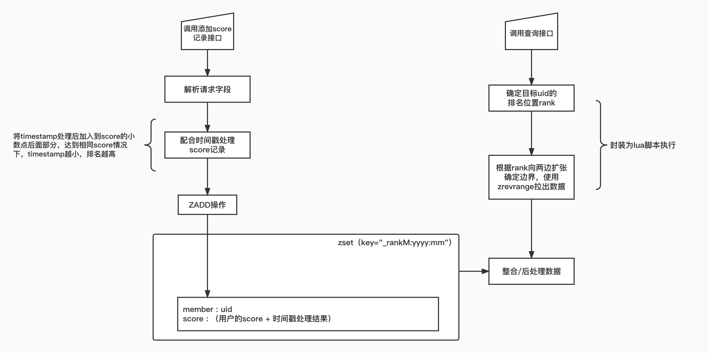

### 基于redis实现的排行榜功能

- - - - -
本项目是一个基于zset实现的排行榜服务，对外暴露两个接口支持：   
1、设置用户最新得分记录   
2、返回用户排行榜相关信息（1：用户排名；2：用户得分；3：用户的排名前后各n个人的记录信息）   
接口路由信息如下：   
```
    group := r.Group("/rank")
    group.POST("/set_score", SetScore)
    group.POST("/get_rank_info", GetRankInfo)
```   
- 设置得分接口：  
请求参数
```
type SetScoreRequest struct {
	TraceId         string	    `json:"trace_id"` //链路id / 流水号
	Uid             string	    `json:"uid"`      //用户id
	Score           float64     `json:"score"`    //得分记录
	TimeStamp       int64       `json:"timestamp"`//得分操作的时间戳
}
```   
响应参数   
```
type SetScoreResponse struct {
	TraceId			string          `json:"trace_id"`  //链路id / 流水号
	Status 			int             `json:"status"`    //请求结果状态 0：失败；1：成功
	
	ErrMsg 			string          `json:"err_msg,omitempty"` //错误信息，仅status==0时存在该字段
}
```    
- 查询排名接口：   
  请求参数
```
type GetRankInfoRequest struct {
	TraceId         string      `json:"trace_id"`  //链路id / 流水号
	Uid             string      `json:"uid"`       //用户id
	RangeNum        int         `json:"range_num"` //查询前后多少个人
	DateYear        int         `json:"date_year"` //查询时间-年
	DateMouth       int         `json:"date_mouth"`//查询时间-月
	TimeStamp       int64       `json:"timestamp"`
}

```   
  响应参数
```
type GetRankInfoResponse struct {
	TraceId         string          `json:"trace_id"`
	Status          int             `json:"status"`
	RankInfo        *RankInfoItem   `json:"rank_info"`   //用户排名信息
	RankRange       []*RankInfoItem	`json:"rank_range"`  //用户前后人的排名信息

	ErrMsg          string          `json:"err_msg,omitempty"`
}

type RankInfoItem struct {
	Uid  			string		`json:"uid"`        //用户id
	RankPos 		int64 		`json:"rank_pos"`   //排名位置
	Score 			float64   	`json:"score"`      //用户得分
}
```  

主体结构：   


测试case:    
接口url：`http://127.0.0.1:7700/rank/set_score`   
请求参数：
```json
{
    "trace_id":"9176bb84-7b4c-4696-b66b-ef0a7025c1e3",
    "uid":"1004",
    "score":1001,
    "timestamp":1660138896745
}
```
响应示例：   
```json
{
    "trace_id": "9176bb84-7b4c-4696-b66b-ef0a7025c1e3",
    "status": 1
}
```

接口url：`http://127.0.0.1:7700/rank/get_rank_info`   
请求参数：
```json
{
  "trace_id":"205d5ab3-612f-4f5c-b86c-f54725fd2739",
  "uid":"1001",
  "range_num":2,
  "date_year":2022,
  "date_mouth":8,
  "timestamp":1660128896744
}
```
响应示例：
```json
{
  "trace_id": "205d5ab3-612f-4f5c-b86c-f54725fd2739",
  "status": 1,
  "rank_info": {
    "uid": "1001",
    "rank_pos": 4,
    "score": 1200
  },
  "rank_range": [
    {
      "uid": "1003",
      "rank_pos": 2,
      "score": 1201
    },
    {
      "uid": "1002",
      "rank_pos": 3,
      "score": 1201
    },
    {
      "uid": "1001",
      "rank_pos": 4,
      "score": 1200
    },
    {
      "uid": "1004",
      "rank_pos": 5,
      "score": 1001
    },
    {
      "uid": "1006",
      "rank_pos": 6,
      "score": 1000
    }
  ]
}
```